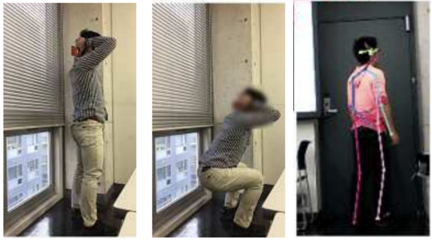
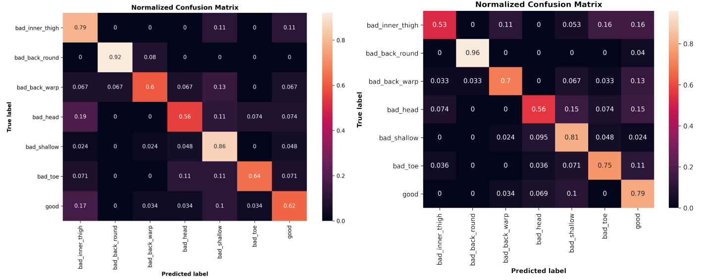

# About The Project

This repository contains code to pre-process, train, and evaluate a convolutional neural network and a long short-term memory network that assess squat performance using 3D pose data from 2D video. Each squat example is labeled in one of seven classes. Full details about the project can be found in [this report](https://drive.google.com/file/d/16j3zEOiGXbspaeT0jAaZu7jnXM2hwN6T/view).

  

# Installation

Currently, this repo can only be built from source. To do so, clone the repo:  
    ```  
    git clone https://github.com/marissalee20/squat-analysis.git
    cd squat-analysis
    ```

  

# Usage

  

## Data

Data was obtained from [Ryoji Ogata's website](http://hi.cs.waseda.ac.jp/~ogata/Dataset.html). Data preprocessing is handled in [preprocess-data.ipynb](preprocess-data.ipynb).

<p align="center">
    <br />
    (left and middle) Example frames from a 2D squat video. (right) Example of 3D pose data overlayed across video. (Courtesy of [1].)
</p>     

## Training and Evaluating Models

The convolutional neural network is trained and evaluated in [ogata-model.ipynb](ogata-model.ipynb). The long short-term memory network is trained and evaluated in [lstm-model.ipynb](lstm-model.ipynb). Model performances are compared in [model-comparison.ipynb](model-comparison.ipynb).


<p align="center">
    <br />
    Normalized Confusion Matrices for the (left) 1D CNN and (right) LSTM.
</p>

The files that support ("combined classes") combine the "upwards head" and "shallowness" classes (the two classes that are most confused with each other in the 7-class problem). These models do not perform better than the 7-class problem and are not recommended for use.

  

# Reference

The data in this project was provided openly by Ryoji Ogata:

[1] Ogata R. *et al*. Temporal distance matrices for squat classification. *2019 IEEE/CVF Conference on Computer Vision and Pattern Recognition Workshops (CVPRW)*, 2019, pp. 2533-2542. [Article](https://doi.org/10.1109/CVPRW.2019.00309) [Dataset](http://hi.cs.waseda.ac.jp/~ogata/Dataset.html)
